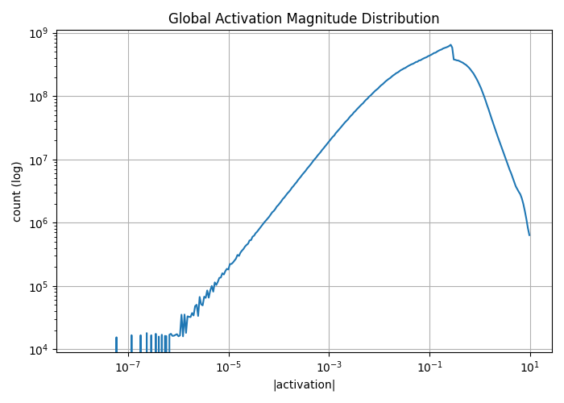
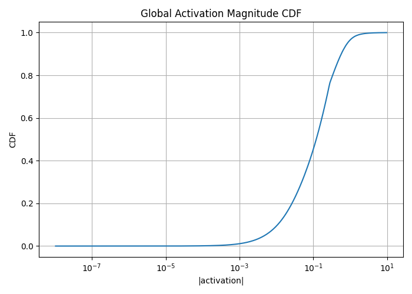
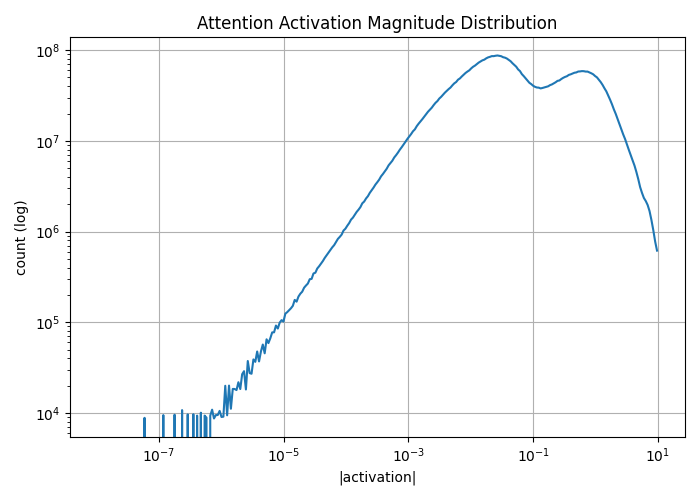
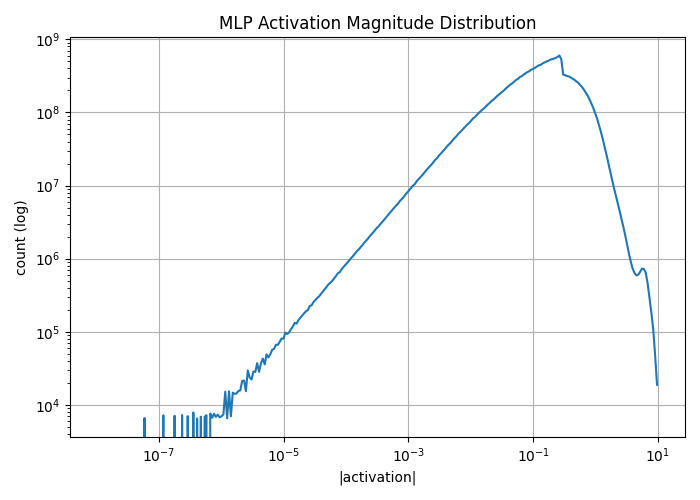
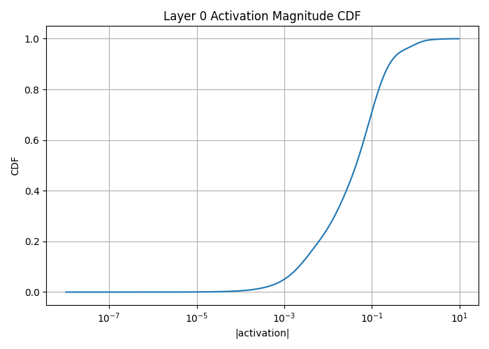
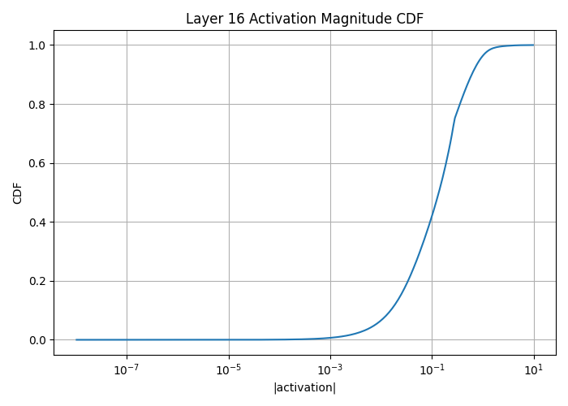
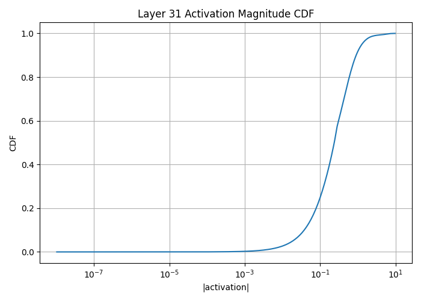

# Understanding Activation Magnitude Visualizations

This document explains **each activation magnitude plot** produced by  
`activation_magnitude_visualization.py` and how to interpret them **correctly and confidently**.

Unlike weight analysis (static), **activation analysis reflects real model behavior under data**.  
These plots answer the question:

> *What parts of the model actually fire, how strongly, and how often?*

All activations are collected during forward passes on validation text and aggregated using **log-scale histograms and CDFs**.

---

## 1. Global Activation Magnitude Distribution  
*(Histogram, log–log scale)*

### What this plot represents
- **X-axis:** Absolute activation value `|a|` (log scale)
- **Y-axis:** Number of activations in each magnitude range (log scale)
- Includes activations from:
  - All layers
  - Attention + MLP
  - All tokens
  - All validation samples

This answers:
> *What activation scales does the model actually use during inference?*

### How to read it
- **Very small values (`<1e-6`)**  
  Near-zero activations → weakly contributing or inactive neurons
- **Mid-range (`1e-4 → 1e-1`)**  
  Core operating region of the model
- **Large values (`>1`)**  
  Rare but strong activations → decisive features or routing signals

### What it tells you
- Activations are well-contained (no explosion)
- Most computation happens in a narrow, stable band
- Presence of a controlled heavy tail is healthy

This plot gives a **global picture of activation energy usage**.

---

## 2. Global Activation Magnitude CDF  
*(Cumulative Distribution Function)*

### What this plot represents
- **X-axis:** Absolute activation value `|a|`
- **Y-axis:** Fraction of activations ≤ `x`

This answers:
> *What percentage of activations are smaller than a given threshold?*

### How to read it
Example:
- CDF ≈ 0.9 at `|a| = 0.2`  
  → 90% of all activations are ≤ 0.2

### Why this plot matters
This is the **most important plot for activation-aware decisions**:
- Quantization thresholds
- Activation clipping
- Dynamic range selection
- Mixed-precision safety

A steep rise means:
- Most activations are small
- Large activations are rare and concentrated

---

## 3. Attention Activation Magnitude Distribution  
*(Histogram, attention-only)*

### What this plot represents
Histogram of activation magnitudes **only from attention layers**:
- Query, Key, Value projections
- Attention outputs

### Why attention is special
Attention:
- Controls information flow between tokens
- Is more sensitive to distortion
- Often shows sharper activation patterns

### How to interpret it
- Narrower distribution → tighter numerical control
- Fewer extreme values → stable attention dynamics

This plot helps assess **how risky attention quantization or pruning would be**.

---

## 4. MLP Activation Magnitude Distribution  
*(Histogram, MLP-only)*

### What this plot represents
Histogram of activations from **MLP (feedforward) layers only**.

### Why MLPs behave differently
MLPs:
- Are massively overparameterized
- Act as feature generators
- Naturally tolerate sparsity and noise

### How to interpret it
- Heavier mass near small values → redundancy
- Slightly heavier tail than attention → acceptable

This confirms that **MLPs are the safest target for compression and pruning**.

---

## 5. Layer 0 Activation Magnitude CDF  
*(Early-layer behavior)*

### What this plot represents
CDF of activation magnitudes **only from the first transformer block**.

### Why early layers matter
Early layers:
- Shape initial representations
- Are close to embeddings
- Can affect everything downstream

### How to interpret it
- Slower CDF rise → fewer small activations → be cautious
- Faster rise → redundancy even at early stages

This checks whether **early layers need protection**.

---

## 6. Layer 16 Activation Magnitude CDF  
*(Middle-layer behavior)*

### What this plot represents
CDF for a representative **middle transformer layer**.

### Why middle layers are important
Middle layers often:
- Absorb representational load
- Contain redundancy
- Are robust to compression

A steep early rise here signals **high compressibility**.

---

## 7. Layer 31 Activation Magnitude CDF  
*(Late-layer behavior)*

### What this plot represents
CDF of activations from the **final transformer layer**.

### Why late layers are sensitive
Late layers:
- Are close to logits
- Directly influence output probabilities
- Can amplify numerical errors

### How to interpret it
- Right-shifted curve → stronger activations → handle carefully
- Similar to other layers → uniform behavior

This plot guards against **output degradation**.

---

## How to Use These Plots Together

### Histograms
Use to:
- Understand activation scale
- Compare attention vs MLP behavior
- Spot pathological activation ranges

### CDFs
Use to:
- Set clipping thresholds
- Choose quantization ranges
- Compare layer sensitivity

**Histograms build intuition.  
CDFs drive engineering decisions.**

---

## Key Takeaway Mental Model

> Weights define *capacity*.  
> Activations define *usage*.

A model with stable, well-bounded activations:
- Quantizes cleanly
- Prunes safely
- Runs reliably in low precision

Your plots show **controlled activation energy**, which is exactly what you want before moving to:
- INT8 / INT4 activation quantization
- Activation-aware pruning
- Runtime sparsity analysis

---

## Summary

- **Global histogram:** overall activation scale
- **Global CDF:** activation clipping & quantization control
- **Attention histogram:** sensitivity check
- **MLP histogram:** redundancy confirmation
- **Layer-wise CDFs:** compression safety by depth