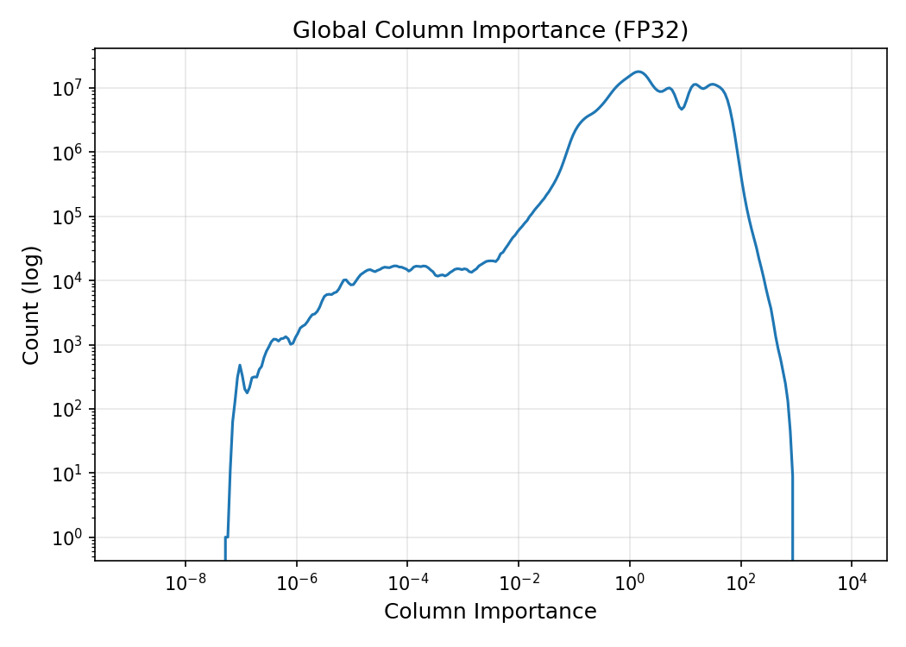
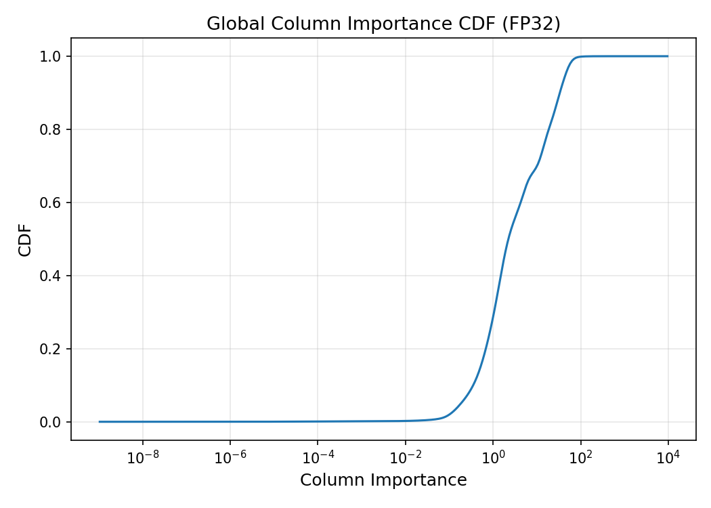
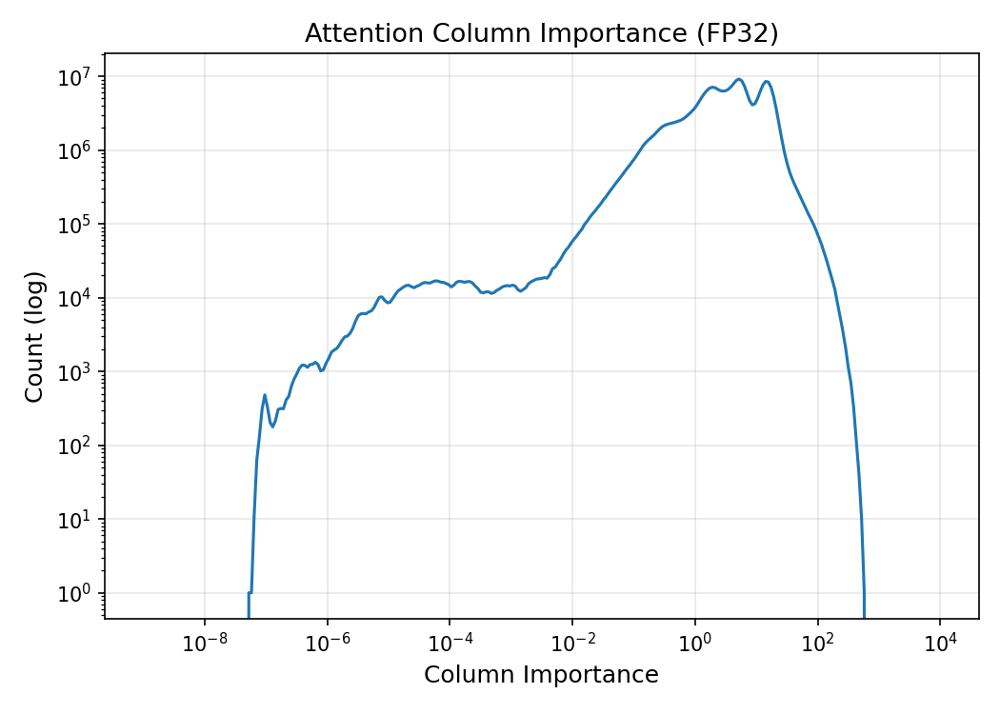
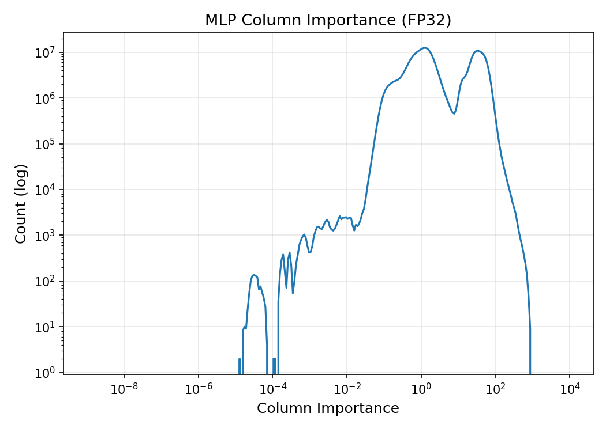
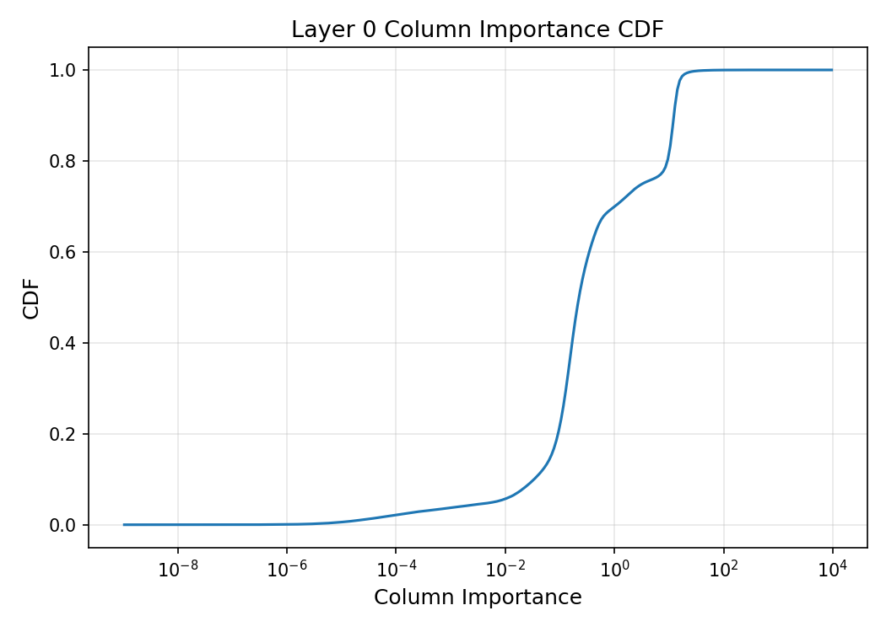
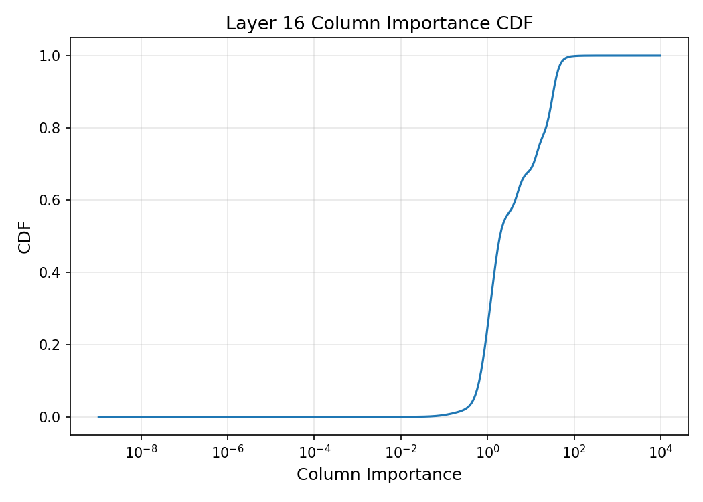
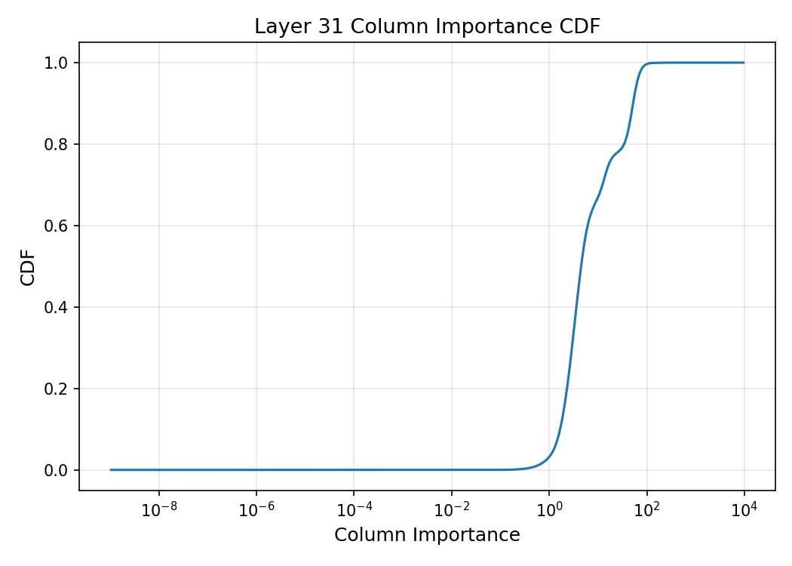

# Understanding Column-wise Importance Visualizations (FP32)

This document explains **each column-wise importance plot** produced by  
`wa_importance_visualization.py` and how to interpret them **correctly and confidently**.

Column-wise importance answers a different (and deeper) question than weight or activation magnitude:

> *Which input feature directions (columns) actually matter during computation?*

Each column corresponds to **one input dimension** of a linear layer (e.g., hidden size).  
Importance is computed dynamically as:
column_importance = sum(|W_column|) × mean(|activation|)

This combines:
- **Structural capacity** (weights)
- **Runtime usage** (activations)

All analysis here is done in **full FP32 on CPU** for numerical stability.

---

## 1. Global Column Importance Distribution (FP32)  
*(Histogram, log–log scale)*

### What this plot represents
- **X-axis:** Column importance value (log scale)
- **Y-axis:** Number of columns in each importance range (log scale)
- Aggregated over:
  - All layers
  - Attention + MLP
  - All validation samples

This answers:
> *How many input feature directions are weak vs dominant across the entire model?*

### How to read it
- **Far left (`<1e-6`)**  
  Columns that are almost never used → structurally present but functionally irrelevant
- **Middle (`1e-2 → 1`)**  
  Moderately important, shared representational features
- **Right tail (`>10`)**  
  High-impact feature directions that strongly influence computation

### What it tells you
- The model uses **only a small fraction of its column space strongly**
- There is a **long tail of weak columns**
- This is *direct evidence* of overparameterization at the feature level

This plot alone justifies **structured pruning and low-rank compression**.

---

## 2. Global Column Importance CDF (FP32)  
*(Cumulative Distribution Function)*

### What this plot represents
- **X-axis:** Column importance threshold
- **Y-axis:** Fraction of columns with importance ≤ threshold

This answers:
> *If I remove all columns below threshold T, what fraction of columns disappear?*

### How to read it
Example:
- CDF ≈ 0.8 at importance = 10  
  → 80% of columns contribute less than 10 units of importance

### Why this plot is critical
This is your **primary pruning control surface**:
- Structured column pruning
- Low-rank factorization
- Hidden-dimension reduction
- LoRA / adapter rank selection

The sharp knee indicates **safe pruning territory**.

---

## 3. Attention Column Importance Distribution (FP32)  
*(Histogram, attention-only)*

### What this plot represents
Column-wise importance restricted to **attention linear layers**:
- Q, K, V projections
- Output projection

### Why attention columns matter
Attention columns:
- Control token-to-token routing
- Encode positional and relational structure
- Are typically more fragile than MLP columns

### How to interpret it
- Narrower distribution than MLP
- Fewer extremely weak columns
- Importance mass shifted slightly right

This confirms:
> **Attention is less redundant than MLP, but still not dense.**

Prune here conservatively and structurally.

---

## 4. MLP Column Importance Distribution (FP32)  
*(Histogram, MLP-only)*

### What this plot represents
Column-wise importance for **MLP feedforward layers only**.

### Why MLP columns behave differently
MLPs:
- Expand hidden dimension aggressively
- Act as feature banks
- Are intentionally overcomplete

### How to interpret it
- Large mass near very low importance
- Clear multi-modal structure
- Heavy redundancy

This is your **primary compression target**:
- Column pruning
- Low-rank factorization
- Width reduction

MLPs will tolerate **aggressive structured pruning**.

---

## 5. Layer 0 Column Importance CDF  
*(Early-layer behavior)*

### What this plot represents
CDF of column importance **only from layer 0**.

### Why early layers matter
Early layers:
- Process embeddings directly
- Set the representational basis
- Errors propagate forward

### How to interpret it
- Slower initial rise → fewer weak columns
- Stronger reliance on most columns

Conclusion:
> **Early layers should be pruned more cautiously.**

---

## 6. Layer 16 Column Importance CDF  
*(Middle-layer behavior)*

### What this plot represents
CDF for a **middle transformer layer**.

### Why middle layers are special
Middle layers:
- Are highly overparameterized
- Absorb representational flexibility
- Are robust to structural changes

A steep rise here means:
> **Large fraction of columns are safely removable.**

This is an ideal target for structured pruning.

---

## 7. Layer 31 Column Importance CDF  
*(Late-layer behavior)*

### What this plot represents
CDF for the **final transformer layer**.

### Why late layers are sensitive
Late layers:
- Are close to logits
- Affect output probabilities directly
- Amplify pruning errors

### How to interpret it
- Right-shifted curve → stronger columns dominate
- Still shows redundancy, but less than MLP middle layers

Prune conservatively here, preserve top columns.

---

## How to Use These Plots Together

### Histograms
Use to:
- Understand redundancy shape
- Compare attention vs MLP
- Detect multi-modal feature usage

### CDFs
Use to:
- Choose pruning thresholds
- Decide per-layer pruning ratios
- Design structured sparsity schedules

**CDFs drive decisions. Histograms build intuition.**

---

## Key Mental Model

> Weights define *capacity*.  
> Activations define *usage*.  
> Column importance defines *effective dimensionality*.

If 80% of columns carry negligible importance,  
then **your model is effectively lower-rank than it appears**.

---

## Summary

- **Global histogram:** overall feature redundancy
- **Global CDF:** how many columns can be removed
- **Attention histogram:** routing sensitivity
- **MLP histogram:** redundancy confirmation
- **Layer-wise CDFs:** depth-aware pruning safety

These plots are the bridge between:
- Unstructured pruning → **structured compression**
- Guessing → **measured architectural reduction**