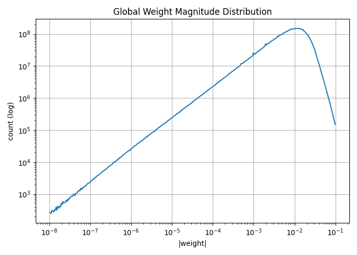
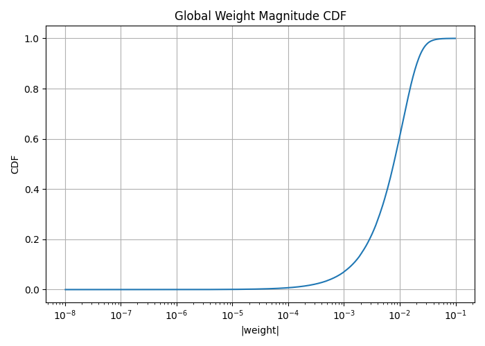
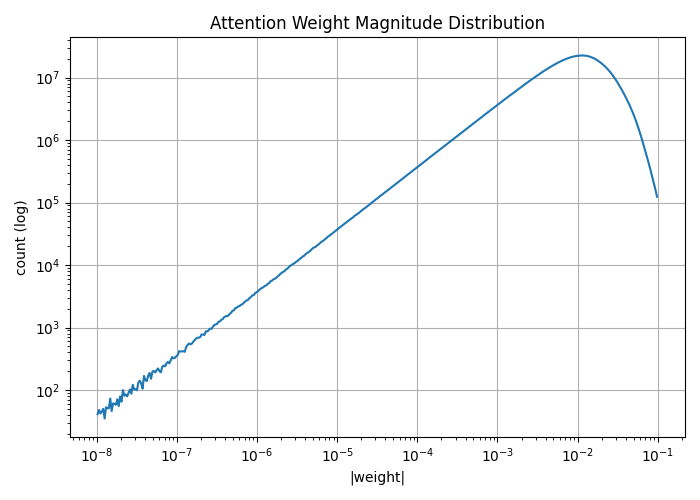
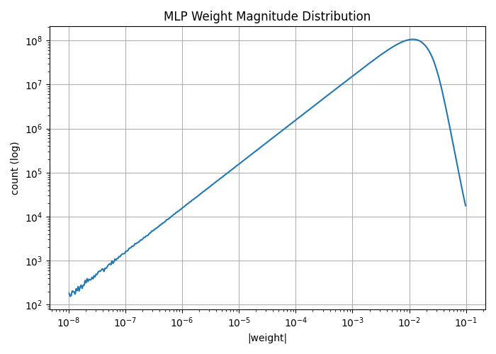
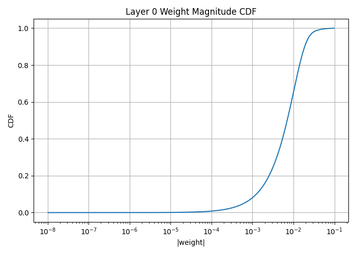
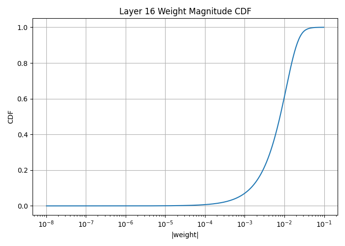
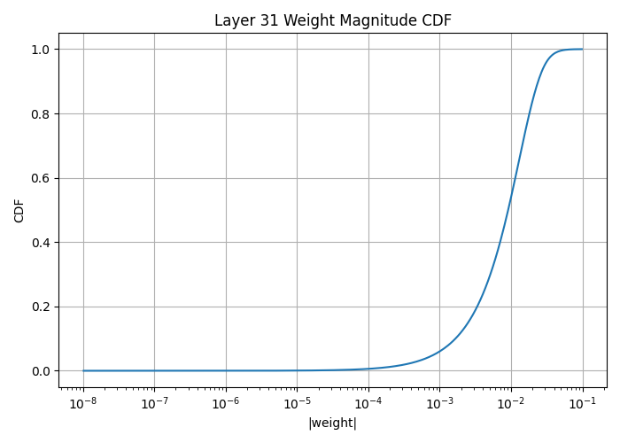

# Understanding Weight Magnitude Visualizations for Pruning

This document explains **each graph** produced during the weight magnitude analysis of a large language model and how to interpret them **correctly and confidently**.  
The goal is to remove confusion and clearly connect each plot to pruning decisions.

---

## 1. Global Weight Magnitude Distribution  
*(Histogram, log–log scale)*

### What this graph represents
- **X-axis:** Absolute weight value `|w|` (log scale)
- **Y-axis:** Number of weights in each magnitude range (log scale)

This graph answers:
> *How many parameters exist at different magnitudes across the entire model?*

### How to read it
- Left side (`1e-8` → `1e-6`): very small weights  
- Middle (`1e-4` → `1e-2`): typical weights  
- Right (`>1e-2`): large, likely important weights  

Because the bins are logarithmic, the curve often rises smoothly and then falls.

### What it tells you
- Whether the model contains many small-magnitude weights
- Whether magnitude-based pruning is even viable
- The **overall redundancy profile** of the model

This plot builds intuition, but it is **not** the pruning decision tool.

---

## 2. Global Weight Magnitude CDF  
*(Cumulative Distribution Function, log scale on x-axis)*

### What this graph represents
- **X-axis:** Absolute weight value `|w|`
- **Y-axis:** Fraction of all weights with magnitude ≤ `x`

This graph answers:
> *If I choose a threshold T, what percentage of weights will be pruned?*

### How to read it
Example:
- If CDF ≈ 0.6 at `|w| = 1e-2`  
  → ~60% of all weights are ≤ `1e-2`

### The “knee” of the curve
- Flat region: very few weights
- Steep region: most weights live here
- The transition point (“knee”) marks **safe pruning territory**

### Why this graph is critical
This is the **main pruning control knob**:
- Want 40% sparsity → choose T where CDF(T)=0.40
- Want 60% sparsity → choose T where CDF(T)=0.60

If you only use one plot for pruning decisions, use this one.

---

## 3. Attention Weight Magnitude Distribution  
*(Histogram, attention-only parameters)*

### What this graph represents
Same as the global histogram, but **only for attention parameters**:
- Query, Key, Value, Output projections

### Why attention is special
Attention layers:
- Encode token-to-token structure
- Are usually more sensitive to pruning
- Have fewer truly redundant parameters

### How to interpret it
- Fewer tiny weights → prune conservatively
- Distribution shifted right → attention weights are more critical

This plot helps prevent **over-pruning attention**.

---

## 4. MLP Weight Magnitude Distribution  
*(Histogram, MLP-only parameters)*

### What this graph represents
Histogram of absolute values for **MLP (feedforward) layers only**.

### Why MLPs behave differently
MLPs:
- Expand hidden dimension massively
- Act as feature banks
- Are intentionally overparameterized

### How to interpret it
- Large mass of small weights → high redundancy
- Strong candidate for aggressive pruning

In practice, **MLPs tolerate much higher sparsity than attention**.

---

## 5. Layer 0 Weight Magnitude CDF
  
*(Early-layer CDF)*

### What this graph represents
CDF of weights **only from layer 0** (first transformer block).

### Why early layers matter
Early layers:
- Are close to embeddings
- Shape initial representations
- Can be more sensitive in some models

### How to interpret it
- Slower-rising CDF → fewer small weights → prune carefully
- Faster-rising CDF → more redundancy

This plot checks whether layer 0 needs protection.

---

## 6. Layer 16 Weight Magnitude CDF  
*(Middle-layer CDF)*

### What this graph represents
CDF for a **middle transformer layer**.

### Why middle layers are interesting
Middle layers often:
- Contain redundancy
- Can be pruned with minimal impact
- Absorb pruning damage better

If this CDF rises earlier than others, it’s a strong pruning target.

---

## 7. Layer 31 Weight Magnitude CDF  
*(Last-layer CDF)*

### What this graph represents
CDF of weights from the **final transformer layer**.

### Why last layers can be fragile
Last layers:
- Are close to logits
- Directly affect output probabilities
- Often require more caution

### How to interpret it
- Similar curve to other layers → uniform redundancy
- Shifted right → protect this layer more

This plot ensures pruning doesn’t damage output quality.

---

## How to Use These Plots Together

### Histograms
Use for:
- Understanding typical weight scales
- Comparing attention vs MLP redundancy
- Spotting abnormal distributions

### CDFs
Use for:
- Choosing pruning thresholds
- Setting sparsity targets
- Comparing redundancy across layers

**CDFs drive decisions. Histograms build intuition.**

---

## Mental Model to Remember

> Overparameterization creates many directions in weight space that do not meaningfully affect loss.  
> Magnitude-based pruning removes those directions.

Your plots show a **wide flat basin**, which is exactly what you want before pruning.

---

## Summary

- **Global histogram:** where weights live by magnitude  
- **Global CDF:** how many weights you remove at a given threshold  
- **Attention histogram:** attention pruning sensitivity  
- **MLP histogram:** where most redundancy lives  
- **Layer-wise CDFs:** which layers tolerate pruning better  

Once these plots make sense, pruning stops being guesswork and becomes controlled engineering.

---